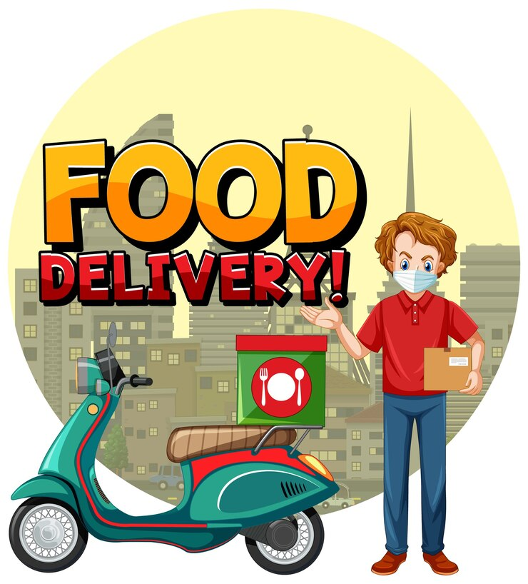

# django-delivery-app


## Online service for delivering food from shops

## Setup and Local Installation

### To set up and run the project locally, follow these steps:

#### 1.  Clone the repository:

```python
git clone https://github.com/OleksandrYanchuk/django-delivery-app.git
```
#### 2. Open the folder:
```python
cd django-delivery-app
```
#### 3. Create a virtual environment:
```python
python -m venv venv
```
#### 4. Activate the virtual environment:
   
##### - For Windows:
```python
venv\Scripts\activate
```
##### -	For macOS and Linux:
```python
source venv/bin/activate
```
#### 5. Setting up Environment Variables:

##### 1. Rename a file name `.env_sample` to `.env` in the project root directory.

##### 2. Make sure to replace all enviroment keys with your actual enviroment data.

#### 6. For run application manually make next steps:

```python
pip install -r requirements.txt
```
```python
python manage.py migrate
```
#### 7.Run server:
```python
python manage.py runserver
```
#### 8. Open your web browser and go to http://localhost:8000 to access the application.
